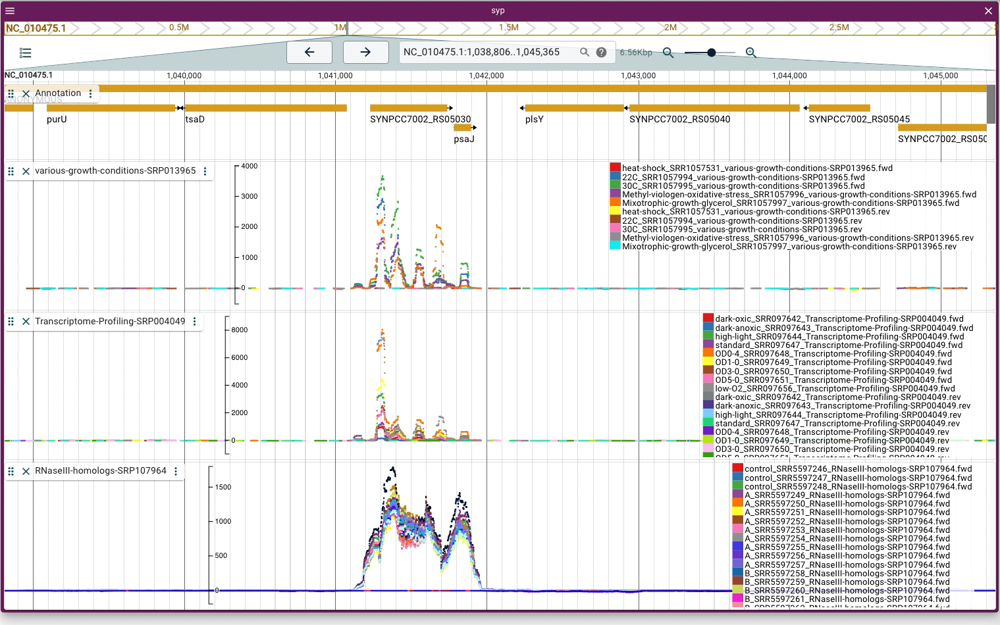

# RNA-browser

This **RNA-browser**
snakemake pipeline maps *microbial* (without splicing) **RNA-seq** data and automatically sets up
genome coverage tracks in a [Jbrowse](https://jbrowse.org/jb2/) browser.
The pipeline supports both **paired-end** and **single-end**.
Further, it is possible to specify *per library* if the reads (read1 in case of paired-end) are
forward or reverse complementary mapping to the strand of transcription origin.
As such, it is possible to process multiple datasets; the corresponding
RNA-seq genome coverage tracks will be grouped per dataset.

For pre-processing (*e.g.* quality filtering) please consider using
[RNA-Schlange](https://github.com/asgeissler/RNA-Schlange).

If you use the **RNA-browser**, please consider citing:

"Genome-scale prediction of stable housekeeping genes in Synechococcus sp. PCC 7002". 
Adrian Sven Geissler, Elena Carrasquer Alvarez, Christian Anthon, Niels-Ulrik Frigaard, Jan Gorodkin, Stefan Ernst Seemann  
*in preparation*

For a showcase of a browser created by this pipeline, please have a look at this 
[browser](https://rth.dk/resources/cyanobacteria/stable-genes/) for RNA-seq data in *Synechococcus sp.* PCC 7002.

The RNA-browser uses the following tools:

- **bowtie2** for read mapping
- **sambamba** for filtering and sorting of mapping files
- **bedtools** to compute the genome coverages
- **featureCounts** for gene expression quantification
- **multiQC** for a summary of the mapping/quantification statistics
- **jbrowse** for vizualization

## Setup

- Install [conda](https://docs.conda.io/en/latest/miniconda.html#)
- install Snakemake and mamba

        $ conda install -n base -c conda-forge mamba
        $ mamba install -c bioconda snakemake

- Download this pipeline

        $ git clone asgeissler/RNA-browser
    
The remaining dependencies will be handled by Snakemake.

For the final configuration of the browser interface,
a web server (npx, servr, apache, etc) is required (see below on [browser interface](#browser-interface))

## User guide

### Input data

All computations and data will be stored within the directory in which
you downloaded this pipeline.

As a user, you need to provide:

1. The genomic **sequence** and **annotation** for your organism of
  interest; please name the files
  `genome.fna.gz` and `genome.gff.gz`.
  You might want to download them from
  either [RefSeq](https://www.ncbi.nlm.nih.gov/refseq/),
  [ENA](https://www.ebi.ac.uk/ena/browser/home).
2. The RNA-seq data in compressed fastq format in the folder `data/*.fastq.gz`
3. A sample file `samples.csv` describing your input.

At a minimum, the `samples.csv` file must contain the columns
'file', 'sample', 'condition', and 'dataset'
The values per row should be comma separated (that is a ',' between each value).

If your experiment is a pair-end RNA-seq dataset, also add the optional
'pair' column and indicate which file contains the first (R1) and second (R2) read-pair.

Per default, the pipeline assumes that all reads (or R1 for paire-end data) maps **reverse** complementarily to
the strand origin, which seems to be the most common behavior of Illumina sequencing data.
If a library is not reversed, the optional column `reverse` indicates with yes/no the desired
behavior. The pipeline will then quantify the expression and show the genome coverages accordingly.

For example, the input data could look like:

        ├── data
        │   ├── file1_1.fastq.gz
        │   ├── file1_2.fastq.gz
        │   ├── file2_1.fastq.gz
        │   ├── file2_2.fastq.gz
        │   └── ...
        ├── genome.fna.gz
        ├── genome.gff.gz
        ├── samples.csv

With the file `samples.csv` describing the reads

        dataset,reverse,sample,condition,pair,file
        X,yes,A,condition1,R1,file1_1.fastq.gz
        X,yes,A,condition1,R2,file1_2.fastq.gz
        X,no,B,condition2,R1,file2_1.fastq.gz
        X,no,B,condition2,R2,file2_2.fastq.gz
        Y,no,C,condition3,R1,file3_1.fastq.gz
        Y,no,C,condition3,R2,file3_2.fastq.gz
        ...

The pipline will compute an analysis folder (see below) in which
all files corresponding to the samples are names
`condition_sample_dataset`. Therefore the pipeline only accepts
sample/condition/dataset with
alpha-numeric names (incl. dash, `-0-9a-zA-Z`).
For paired-end reads, the values for the pairs are either R1 or R2.
The reverse column values are either yes or no.

**Limitation**: As illustrated in the `samples.csv` above, multiple
datasets can be specified and the reverse column can be toggled per
sample. However, currently all libraries must be either single-end or
paired-end at the same-time. These types cannot be mixed
at the moment.

### Running the pipeline

All that is needed to start the pipeline is to execute the helper script with:

        bash run.sh

Alternatively, if you prefer the computations to run in a cluster,
RNA-browser comes with support for **slurm**.
Simply use `bash run_slurm.sh` after adapting the configurations to you
system in `slurmprofile/config.yaml`.

### Pipeline output

The intermediary results of the pipeline are stored
in computaitonal-chronological order as indicated by numeric
prefixes per folder, in the `analysis` directory.

- `00_symlink`:  
  Contains symbolic links to the files in `data` but
  with renaming to `condition_sample_dataset(\_pair)`

- `10_mapping`:  
  The mapping `bam` files generated bowtie2.

- `20_filter`:  
  All mapping's are filtered for mapq scores $\ge 30$, which for bowtie2
  corresponds to a probability of mapping to other position 0.001.
  For pair-end data, only pairs with both reads mapping are kept.

- `21_sorted`:  
  Per genomic coordinate sorted mapping files, with `bai` index, and the
  number of contained alignments (stated in the `*-count.txt` files).

- `30_coverage`:
  Genome coverages, normalized by number of reads (or read pairs)
  mapping filtered alignments per million, in bedgraph format.

- `31_negated`:  
  Coverage files in which the reverse strand has negative numbers.

- `32_sorted`:  
  Sorted coverage files.

- `33_bigwig`:  
  Coverage files in bigwig format.

- `40_subread` and `41_counts.tsv`:  
  Results of the featureCount gene expression quantification.

###  Browser interface

The pipeline sets up for each dataset a multi-wig file track in the `browser` folder.
This folder is *self-contained*, such that it can be copied to a web-service *etc*.

When a user opens the `deploy_url` in their internet browser of choice,
they can click and choose which datasets to show.

However, we would recommend to configure a **default session**, which
will automatically be shown to all new users on start.

Following the
[Jbrowser handbook](ttps://jbrowse.org/jb2/docs/tutorials/config_gui/)
we suggest to use the package manamgent `npm` system to install
the jbrowse command line toolkit.

        npm install -g npx
        npm install -g serve
        npm install -g @jbrowse/cli

If you do not have a web service at which you would like to deploy
your browser, you can start a local web service with `npx serve`.
Afterward, open the admin graphical interface of jbrowse:

    cd browser
    npx serve .
    jbrowse admin-server

We would suggest the following steps in the admin interface:

1. Create a session with a linear genome view
2. Open the track selection and choose which datasets you would like to show per default
3. You can drag the tracks into an order of your choice
4. We would recommend to display datasets in "render type" xyplot and without filling.
   You can even assign custom colors per library.
5. Zoom into a genomic region of interest
6. Save the session
6. Click Admin > Set default session

When now a users opens the default browser, the default sessio is shown, yet
all tracks and datasets which are not displayed are still available in the
track selector.

This animated movie shows how to set a default session:

Additionally, adding a text search index for a user is straight-forward by using the jbrowser command line command

        jbrowse text-index --attributes=Name,ID,locus_tag,old_locus_tag

**Technical note:**

If you use `npx serve` in combination with `jbrowse admin-server` on the same machine,
some internet browser might refuse to display the tracks and assemblies during configuration
due to [cross-origin protection](https://developer.mozilla.org/en-US/docs/Web/HTTP/CORS).
An easy workaround would be to replace all `localhost:3000` (the npx serve port)
occurences in `browser/config.yaml`
by `localhost:9090` (the admin service port).
After successful configuration substitution the ports back.
You can also specify a custom URL, such as `mylab.com/project/browser`.

### Optional Configuration

Aside from the sample sheet with paired-end and single-end data and reverse
complemnatry information, the pipeline
attempts to provide a near configuration-free 
experience. However,
However, a user could still adapt pipeline in the
`config.yaml` file, which is format in
the 
[YAML format](https://en.wikipedia.org/wiki/YAML#Basic_components).

Options ending with "_pe" are used for *paired-end* data, and
"_se" for *single-end* data.

Custamizeable options and their default behavior are:

- 'bowtie_*': Uses bowtie2 default settings. For paired-end data
  only allows concordant pair mapping for Illumina sequencing reads with
  insert sizes up to $700$ bp.

- 'filter_*': Remove all un-mapped reads, low scoring alignments
  (mapq socre $< 30$, corresponds to probability of mapping to other position 0.001),
  and only keep concordant pairs in which both read pass the filter.

- 'featurecount_*': Count reads overlapping with a feature by $\ge 50\%$
  of the read length. Reads count towards genes it has the largest overlap with.
  For paired-end, check the pairs and only count concordant read pairs
  with insert sizes up to $700$ bp.

For the browser, please consider
specifying the URL at which you would like to publish the browser.
The default is set to the `npx server` default localhost port (`deploy_url`).

You might want to also specify the browser title and name that is assigned
per default (`browser_short` and `browser_name`).

Currently, RNA-browser used the Jbrowse package version 2.2.0 (`jbrowse_url`).

## Developer note

When using this pipeline in it's containerized form (e.g. run_singularity.sh), then an image that was build with the following commands will be downloaded.

    # After a complete run of the pipeline (to make sure all works), snapshot the conda envs
    snakemake --containerize > Dockerfile
    # Convert to a singularity file
    # mambaforge does not have curl installed -> use wget
    # `curl URL -o PATH` becomes `wget URL -O PATH`
    # spython incorrectly doubles the '/environment.yaml/environment.yaml'
    spython recipe Dockerfile                              | \
        sed 's,curl \([^ ]*\) -o \([^ ]*\),wget \1 -O \2,' | \
        sed 's,/environment.yaml/environment.yaml,/environment.yaml,' > Singularity
    singularity build --fakeroot rnabrowser-0.1.sif Singularity
    # setup repositry credential
    singularity remote login --username <USER> oras://ghcr.io
    # + enter secret access token
    # upload image
    singularity push rnabrowser-0.1.sif oras://ghcr.io/asgeissler/rnabrowser:0.1

